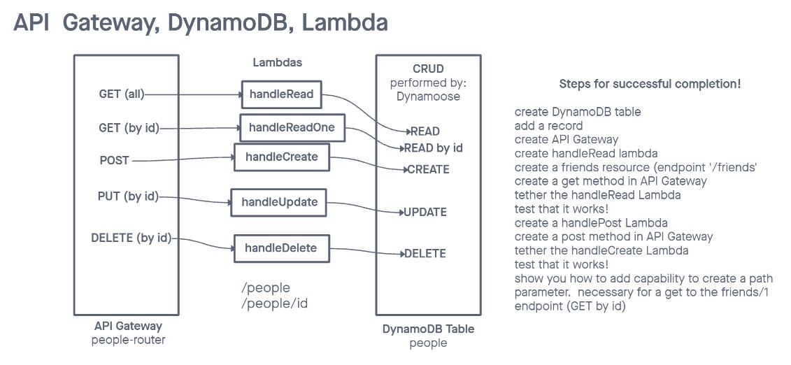

# Lab 18

## Project: serverless-api

## Authors: Kaeden O'Meara

## Problem Domain

Create a serverless REST API.

- Create a single resource REST API using a domain model of your choosing, constructed using AWS Cloud Services.
- Database: DynamoDB, 1 table
- Routing: API Gateway, GET, POST, PUT, DELETE
- `/people`
- `/people/id`

## process

- create dynamo table, and create item.
- create api gateway choose REST API (public)
- select new api named people-router
- go to lambda create function, name function, node.js 18.x
- copy the code over to vscode and bring in dynamoose, `npm init -y`, `npm install dynamoose`
- zip package.json, lock, index, and node_modules
- upload from zip file in lambda
- back to api gateway, action, create resource, create our endpoint, create method which is GET, click `use lambda proxy integration`
- lambda function = handleRead this gives permissions
- add permissions so dynamodb has full access to the lambda role
- in IAM go to roles, click handleRead role, add permissions, attach policy, and search and add `AmazonDynamoDBFullAccess`
- in dynamodb start creating our dynamoose schema
- start creating the new test event, give it a name, and template in this case (api-gateway-aws-proxy)
- create a dynamoose model
- create a variable for our result from getall, await the model `peopleModel.scan().exec()` this is a true getAll
- now to create our handleCreate lambda function
- tether the lambda to api gateway and also add a role(IAM)
- find handleCreate role and add permissions `AmazonDynamoDBFullAccess`
- now to api gateway to the people route actions --> create method
- click test and in the request body add in the new person (in json)
- now to focus on getOne, go to api gateway to get, add resource, resource path = `{id}`

TBC..

## UML

## Collaborators

- Ike
- Reece
- Ryan E
- Demo Code
